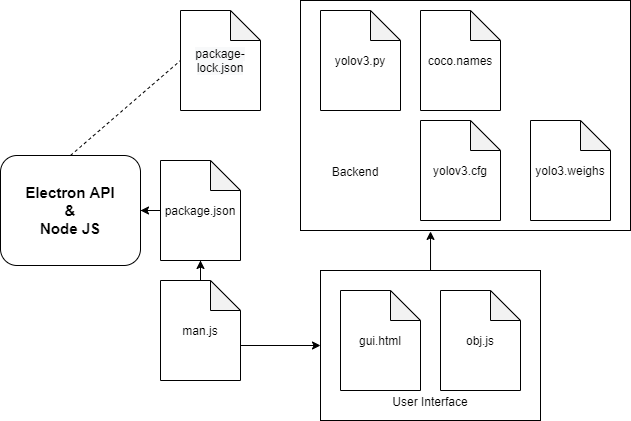

# Desktop-Object-Detection-App
## Descrption
Developed a desktop application that detects objects present in front of the webcam. 

The desktop application uses python code in the backend for obect detection throught the webcam input and displays that on the screen in the real time. 

The result would be saved in a vedio format with the date and time as the name. 

Integrated the yolo v3 model into the pytyhon code for object detection, which takes each frame from the webcam as input. 

The desktop application is powerd by the electron API and Node JS. 

Executed python code using the Python powershell inside the elctron application. 

## Flow of the Project

